# ⚠️ 신고기 사용 매뉴얼

**N블로그 신고**와 **파워링크 내리기**를 위한 프로그램입니다. 프록시 세팅부터 계정 생성, 신고, 트래픽까지 실제 화면 순서대로 정리했습니다.

> **전체 흐름** — ① 프록시(한국 IP) → ② 계정 준비(생성·생존확인) → ③ 신고(키워드·특정) → ④ 파워링크 트래픽

---

## 시작하기 — SmartProxy 가입 · 프록시 생성

프록시가 있어야 계정 생성·신고·트래픽이 돌아갑니다. 아래 초대 링크로 가입한 뒤 **한국(KR) 프록시**를 만들고, 나온 값을 신고기에 넣습니다.

### ① 가입

**➡ [SmartProxy 가입하기](https://www.smartproxy.ai/register/?invitation_code=UH9MV9)** (초대코드 `UH9MV9` 자동 적용)

가입 후 **Residential Proxy(주거용, GB당 요금)** 상품을 사용합니다. 트래픽(GB)을 조금 충전해두면 바로 쓸 수 있습니다.

### ② 개요 화면 — App Key 위치

로그인하면 **개요** 화면 오른쪽에 **App Key**가 있습니다. 이 값이 신고기 상단의 **트래픽 사용량 표시**에 쓰입니다. (App Key·잔액은 가림)

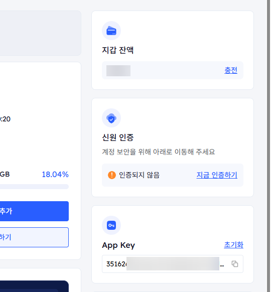

### ③ 프록시 만들기 (아이디&비번 · 한국)

**프록시 › Residential Proxy › [프록시 설정]** 탭에서:

1. 인증 방식 **[아이디&비번 인증]** 선택
2. 프록시 생성기에서 **국가 = South Korea** 선택 (도시·주·ASN은 랜덤 그대로 OK)
3. 오른쪽 **[프록시 생성]** 클릭 → 접속 값 생성

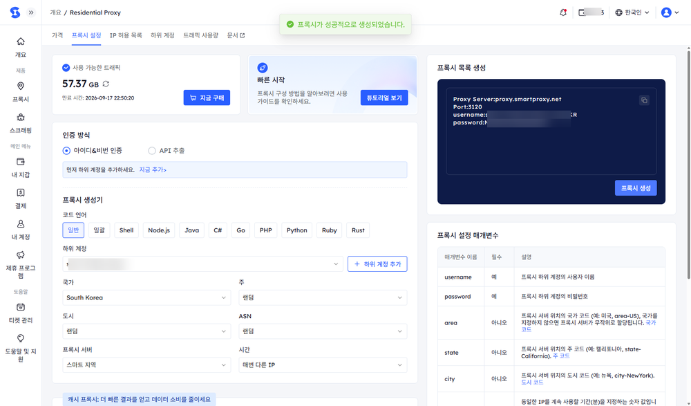

생성되면 **프록시 목록 생성** 박스에 `Proxy Server / Port / username / password`가 나옵니다. (아이디·비번은 가림)

### ④ 신고기 어디에 넣나

신고기 **[아이피 변경]** 탭입니다. 아래 번호가 SmartProxy 값과 연결됩니다.

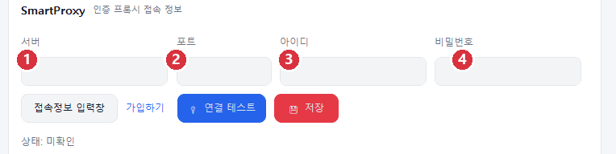

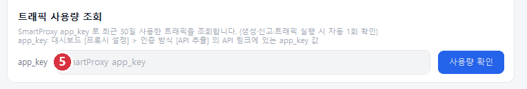

| 번호 | 신고기 칸 | ← SmartProxy 값 |
|---|---|---|
| ① | 서버 | Proxy Server (`proxy.smartproxy.net`) |
| ② | 포트 | Port (`3120`) |
| ③ | 아이디 | username (`…_area-KR` 까지 전체) |
| ④ | 비밀번호 | password |
| ⑤ | app_key | App Key (개요 또는 API 추출) |

> ⚠️ **꼭 확인** — username 끝에 **`_area-KR`** 이 붙어야 한국 IP로 나갑니다. 안 붙으면 해외로 나가 네이버가 즉시 차단합니다. 넣은 뒤 **[연결 테스트] → 한국 IP 확인 → [저장]**.
>
> 💡 프록시 접속용 **아이디/비번**과 사용량 조회용 **app_key**는 **서로 다른 값**입니다.

---

## 1. 프록시 — 아이피 변경

계정 생성·생존확인·신고·트래픽이 **모두 이 프록시로** 나갑니다. **저장하지 않으면 집 IP로 나가 네이버가 바로 막습니다.**

| 입력칸 | 넣는 값 |
|---|---|
| 서버 | `proxy.smartproxy.net` |
| 포트 | `3120` |
| 아이디 | `smart-xxxxxxxx_area-KR` **(한국 필수)** |
| 비밀번호 | SmartProxy 하위계정(sub-user) 비밀번호 |

1. **[연결 테스트]** — 누르면 실제 나가는 IP가 표시됩니다. **한국 IP**면 정상
2. **[저장]** — 저장해야 이후 모든 작업이 이 프록시로 나갑니다 (필수)

---

## 2. 트래픽 사용량 — app_key

상단 헤더의 **🌐 프록시 사용 N GB**는 최근 30일 소비한 트래픽입니다. 표시하려면 SmartProxy의 **app_key**가 필요합니다.

**app_key 얻는 법 (API 추출):**

1. SmartProxy 대시보드 **[프록시 설정]** 탭 이동
2. 인증 방식 **[API 추출]** 선택
3. 국가 **South Korea** 선택
4. **[API 링크 생성]** → 오른쪽 **API 링크** 주소의 `app_key=` **바로 뒤 값**이 app_key
5. 신고기 **[아이피 변경 › 트래픽 사용량 조회]** 칸에 붙여넣고 **[사용량 확인]**

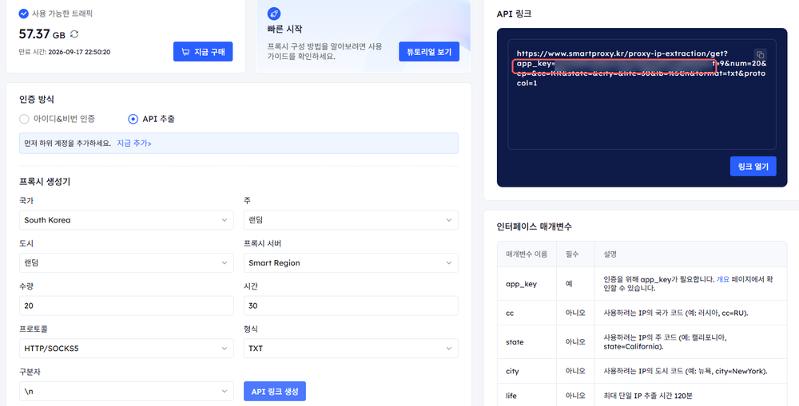

> ⚠️ **복사 범위** — `app_key=` 뒤부터 **다음 `&` 기호 전까지**가 app_key 값입니다. `&pt=`·`&cc=` 등 뒤 파라미터는 넣지 마세요.

---

## 3. 계정 생성 · 생존 확인

신고에 쓸 네이버 계정을 서버에서 만들고 AntiDetect 프로필에 로그인 상태로 연결합니다.

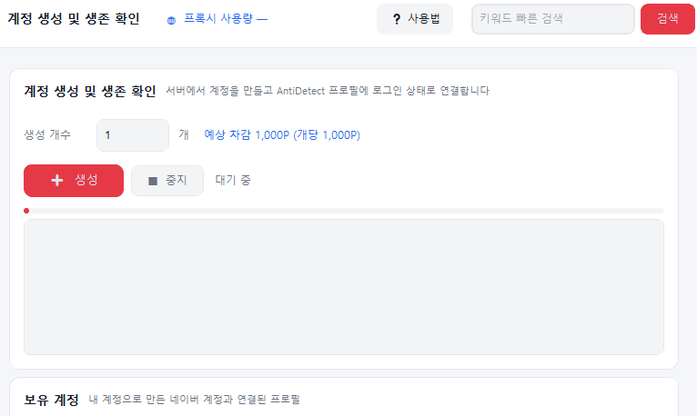

1. **생성 개수** 입력 — 개당 **1,000P** 차감 (예상 차감액 표시)
2. **[➕ 생성]** — 포인트가 없으면 생성이 안 되니 **충전을 먼저** 하세요. 진행 중 경과 시간이 실시간 표시됩니다.
3. **[🩺 생존 확인]** — 만든 계정이 실제 로그인되는지 확인. **신고에는 생존 확인 통과분만** 쓰입니다.

### 💎 포인트 충전 (생성 전 준비)

계정 생성은 **개당 1,000P**가 듭니다. 포인트가 없으면 먼저 충전을 요청하세요. **운영자(개발자)가 입금을 확인하고 승인해야** 포인트가 적립됩니다.

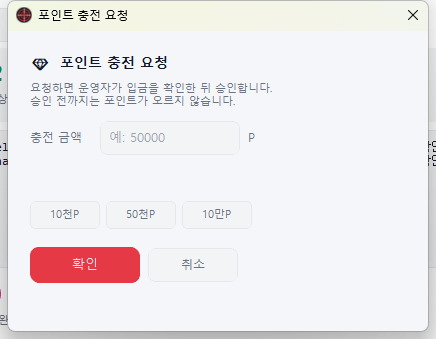

1. 사이드바 포인트 아래 **[눌러서 충전 요청]** 클릭
2. 충전 금액 입력(예: 50,000) 또는 빠른 버튼(10천P·50천P·10만P) → **[확인]**
3. **운영자가 입금 확인 후 승인** — 승인 전까지 포인트가 오르지 않습니다
4. 승인되면 적립 → 계정 생성 시 **개당 1,000P씩 차감**

### 🩺 생존 확인 (live check)

만든 계정이 실제로 로그인되는지 확인합니다. **신고에는 "정상"으로 확인된 계정만** 쓰입니다.

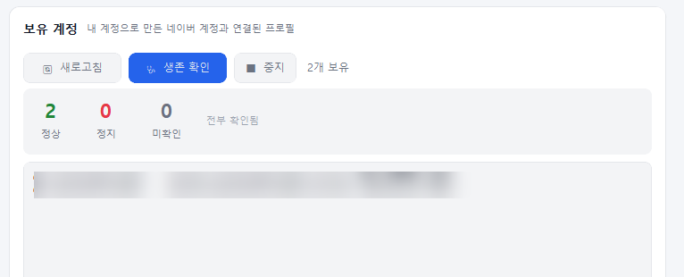

**[🩺 생존 확인]** → 정상 / 정지 / 미확인으로 집계됩니다. (계정명은 가림)

---

## 4. AntiDetect Browser (로컬)

파워링크 트래픽에 쓸, 내 PC에 설치된 AntiDetect를 연결합니다.

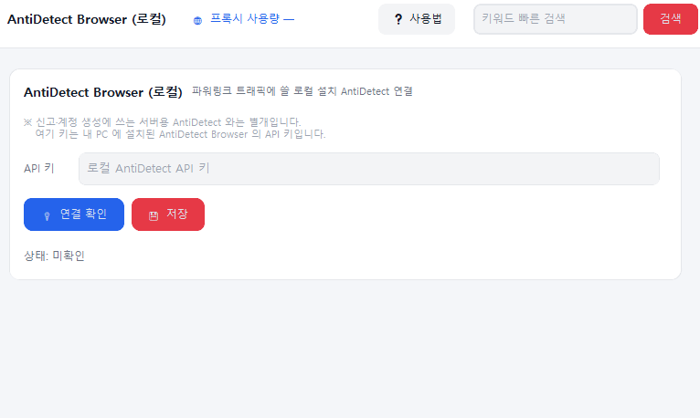

### API 키 얻는 법

키가 **두 종류**라 헷갈리지 마세요.

1. **앱 로그인 키** — AntiDetect Browser 마이페이지의 `xxxx-xxxx-xxxx-xxxx-xxxx` 형식 키. 이걸로 **앱에 로그인**합니다.
2. 로그인 후 **[마이페이지 › API 키 / 포인트]** 이동
3. **API 키**(`sk_…`) 복사 — 없거나 바꾸려면 **[재발급]** (기존 키 즉시 무효)
4. 그 `sk_…` 키를 신고기 **[AntiDetect Browser] API 키** 칸에 붙여넣고 **[연결 확인]**

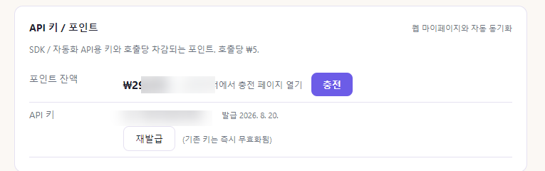

> 💡 **앱 로그인 키**(`xxxx-xxxx-…`)는 앱 로그인용, **API 키**(`sk_…`)는 신고기에 넣는 값입니다. API는 호출당 포인트(₩5)가 차감됩니다.
>
> ※ 여기 키는 **내 PC의 로컬 AntiDetect** 키입니다. 신고·계정 생성에 쓰는 **서버용 AntiDetect와는 다릅니다.**

---

## 5. 키워드 신고

검색어로 상위 게시물을 찾아 한꺼번에 신고합니다. (블로그 전용, 카페는 비활성)

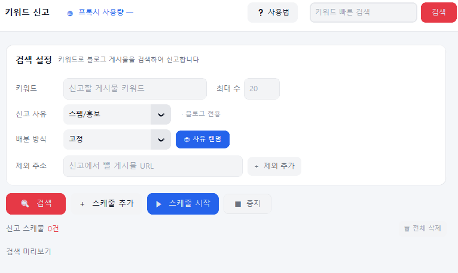

1. **키워드** · **최대 수** 입력
2. **제외 주소** — 신고에서 뺄 게시물 URL을 하나씩 추가 (결과에서 자동 제외)
3. **[검색]**으로 미리 본 뒤 **[＋ 스케줄 추가]**로 키워드를 담음 (여러 개 가능)
4. **[▶ 스케줄 시작]** — 담긴 키워드들을 순서대로 신고. 배분을 랜덤으로 하면 사유가 무작위로 섞입니다.

---

## 6. 특정 게시물

URL을 직접 지정해 신고합니다.

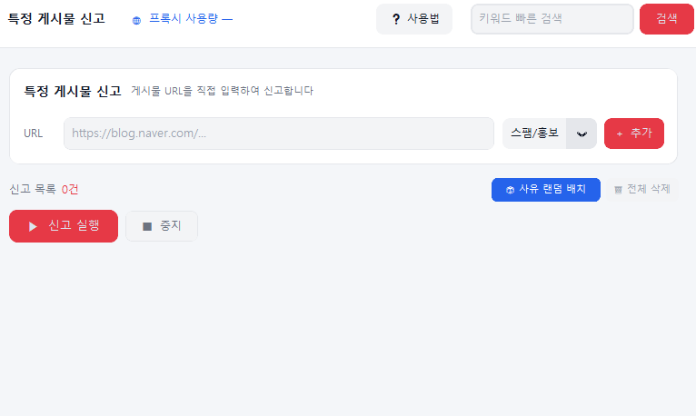

1. 게시물 **URL을 [+ 추가]**해서 목록 구성
2. 행마다 **사유** 지정 또는 **[🎲 사유 랜덤 배치]**
3. **[▶ 신고 실행]**

> **신고 공통 설정** ([아이피 변경] 하단): **IP 로테이션**(1건마다 IP 변경), **신고 간격**(랜덤 범위), **중복 방지**(같은 아이디가 같은 글 재신고 차단) — 모든 신고 방식에 함께 적용.

---

## 7. 계정 신고 리스트

내가 만든 계정들이 **어떤 게시글을 신고했는지** 서버에서 조회합니다.

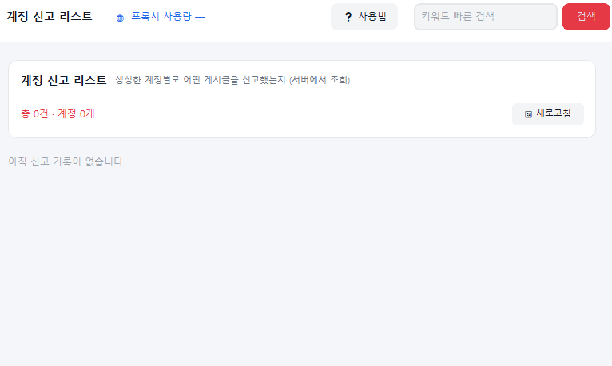

**[🔄 새로고침]**으로 최신 기록을 불러옵니다. **본인(entid) 계정 기록만** 보입니다.

---

## 8. 파워링크 트래픽

경쟁 광고의 예산을 소진시키는 기능입니다. 검색 → 대상 담기 → 클릭 방문.

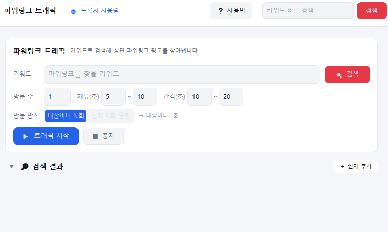

1. **키워드 검색** — 상단 파워링크(광고) 목록을 불러옵니다
2. **[＋ 추가]**로 원하는 광고를 **트래픽 대상**에 담기 (담기면 `✓ 담김`으로 표시, `＋ 전체 추가`도 가능)
3. **방문 방식** 선택 — **대상마다 N회**(각 광고 N번) 또는 **전체 N회 순환**(대상들을 돌며 총 N번)
4. **체류·간격**(초)을 랜덤 범위로 두고 **[▶ 트래픽 시작]**

> **동작 원리** — 트래픽은 **네이버 검색결과의 파워링크 링크를 실제로 클릭**합니다. 이 클릭이 네이버 클릭추적(`adcr.naver.com`)을 타야 광고주에게 과금됩니다. **URL 직접 방문은 광고비가 빠지지 않으므로 하지 않습니다.** 못 찾으면 엉뚱한 업체를 누르지 않고 건너뜁니다.
>
> 로그에 `SmartProxy 우회 IP` · `클릭 → 제목 [도메인]` · `도착: URL`이 찍혀 확인할 수 있고, 결과는 트래픽 전용 CSV로 저장됩니다.

---

## 결과 · 로그

- **📥 결과물 받아보기** — 탭에 따라 다릅니다. 트래픽 탭이면 트래픽 결과표, 신고 탭이면 신고 결과표(CSV).
- **하단 통계** — 트래픽 탭은 트래픽 완료·성공률, 신고 탭은 신고 완료·성공률로 자동 전환.
- **💾 로그 저장 / 📮 로그 보내기** — 처리 로그를 파일로 저장하거나 운영자에게 전송.

---

## 자주 묻는 것

**Q. 프로그램을 껐다 켜면 최신인가요?**
네. 켤 때마다 최신 버전을 받아 실행하고, 새 버전이 있으면 시작 시 업데이트 안내가 뜹니다.

**Q. 트래픽에서 "못 찾아 건너뜀"이 자주 떠요.**
파워링크가 노출되지 않았거나 담은 광고가 그 검색에 없는 경우입니다(엉뚱한 업체 클릭 방지 장치). 키워드를 바꿔 다시 검색하세요.

**Q. AntiDetect가 "연결 안됨"이에요.**
내 PC에서 **AntiDetect Browser 앱을 먼저 실행**한 뒤, 신고기 [AntiDetect Browser] 탭에서 **[연결 확인]**을 눌러주세요.

> ✅ **체크리스트** — ① 프록시 **한국(KR)** 저장 · ② 계정은 **생존 확인** 통과분만 · ③ 트래픽 전 **AntiDetect 앱 실행** · ④ 사용량 보려면 **app_key** 입력
